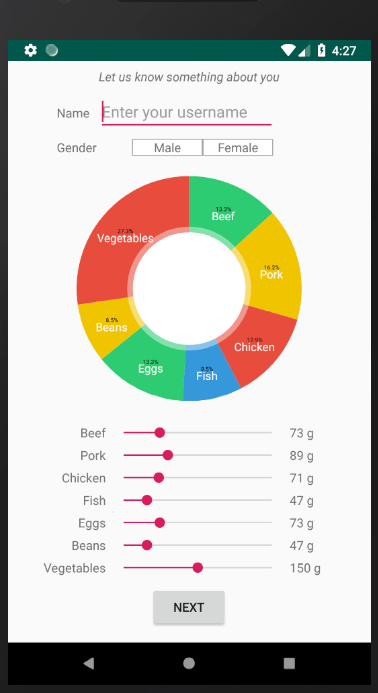
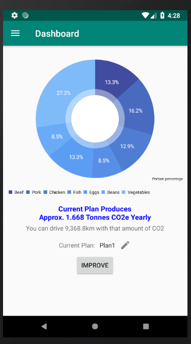
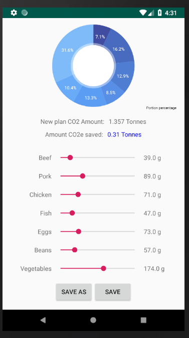
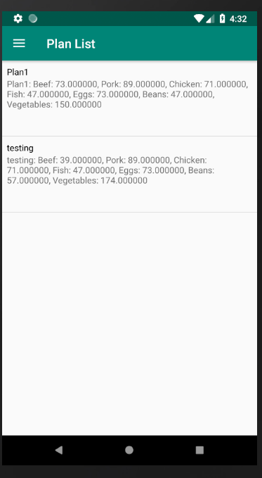
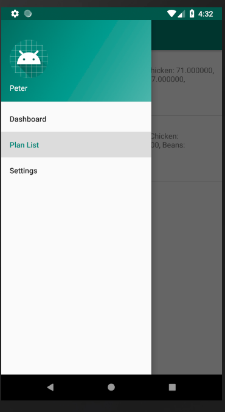
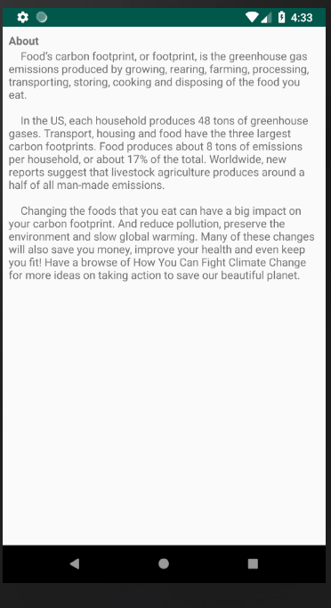

# Header

## Initial Screen Activity
Initial screen

This is the initial activity that appears on the user's first use of the app. Here, the user will be asked to input some information about themselves: Their name, gender, and approximate current meal plan.

## Dashboard Activity
Dashboard:

Upon pressing the edit icon:

## Improve Plan Activity

## Plan List Activity

## Side bar

## About Page Activity

