# Mindful Meal Planner 

## Initialization
For the initialization, the user is allowed to log in with Gmail, or a regular email. If the already exists, then only the password will be required. 
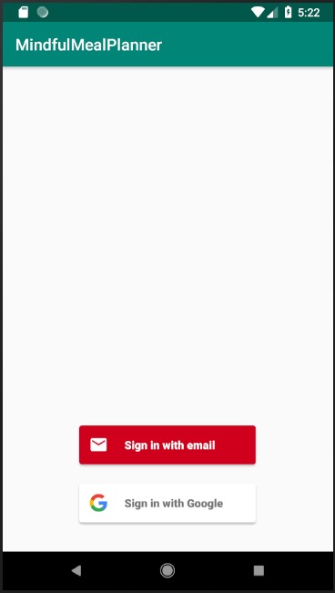 | 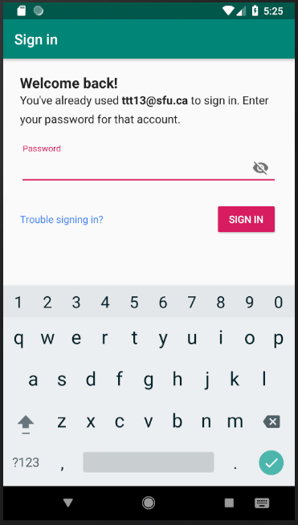

Otherwise, the user will be asked to create a password, select their gender, and enter their initial meal plan.

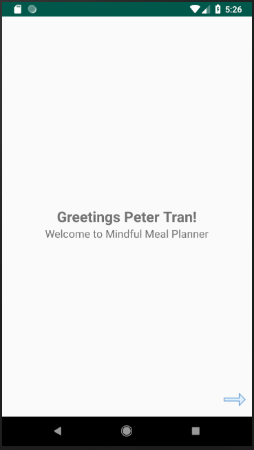 | 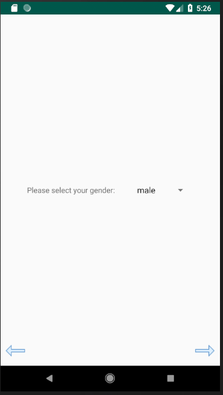 | 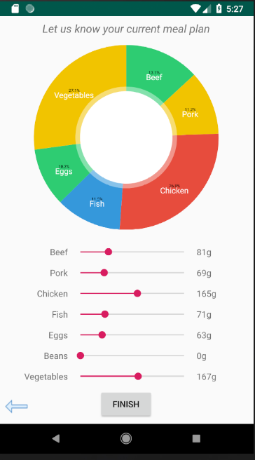

## Dashboard Activity
This dashboard activity provides the user a visual as well as information about their current meal plan and its impact on the environment.

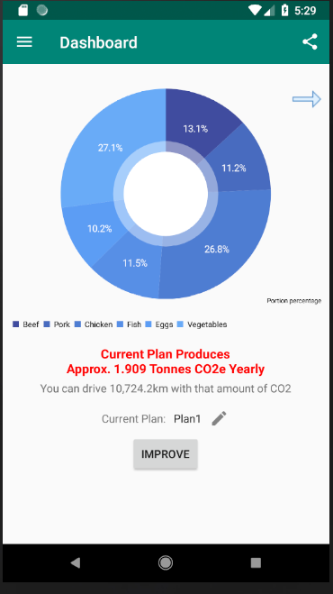 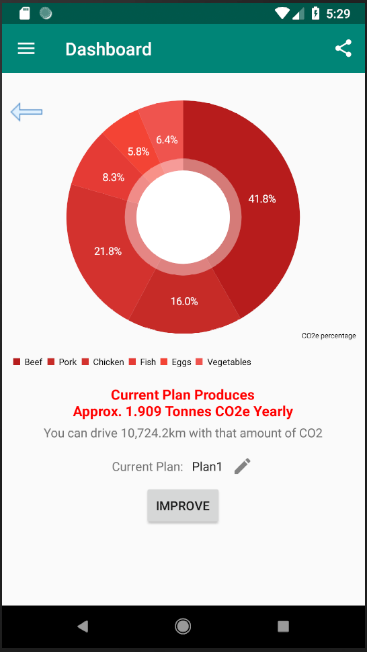

The user can alternate between two pie charts by swiping right or left. The blue pie chart indicates the percentage of each portion in the user's diet. The red pie chart indicates how much each portion contributes to the production of CO2e.

On pressing the edit icon, the user may change the name of their plan if they wish.

 
The user is also given information about approximately how many metric tonnes of CO2e are created from the current food plan, and the equalancy of how many kilometers an average car could drive to produce that amount.
The user's current plan is also displayed. 

## Improve Plan Activity
This activity is reached by pressing the 'Improve' button seen in the dashboard. Here, a new plan is displayed for the user. This plan is generated by an algorithm that seeks to reduce the user's CO2e by 10%. To do this, it uses a scaling factor to slightly adjust each of the user's food portions, starting with those which produce the most CO2e.
A toast will be generated to inform the user how much CO2e could be reduced if all of Metro Vancouver were to use the same plan.

 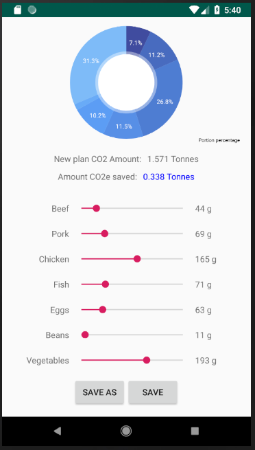

If the user is satisfied with this new plan. The user can press either 'save' or 'save as', where the latter button allows the ability to change the plan name.
If the user wishes to edit the plan, the edit button will reveal sliders and update the amount of CO2e saved in real time. If the plan produces a greater amount of CO2e than the previous plan, the pie graph will turn red as a warning indication.

## Navigation Drawer
A screenshot of the navigation drawer, containing access to the settings activity which contains the about page activity and logout, the dashboard activity, the list of meal plans, and the pledge activity. The sidebar can be reached by either the icon on the top left corner, or by swiping from the left side of the application.

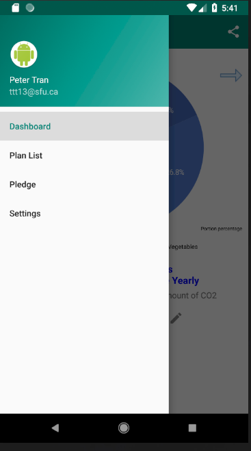 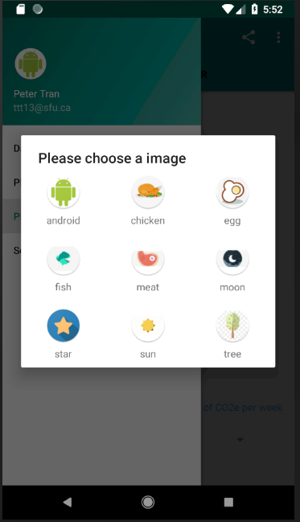

Here, the user may also see their name and email. Upon clicking on their avatar, they can change their picture if they wish.

## Pledge Activity
The pledge activity has two fragments. The 'My Pledge' fragment allows the user to make a pledge of how many kilograms of CO2 they will commit to saving in a week. The 'Discover' fragment allows the user to see other users and their pledges, as well as various statistics on the pledges. The user may also filter pledges by municipality.

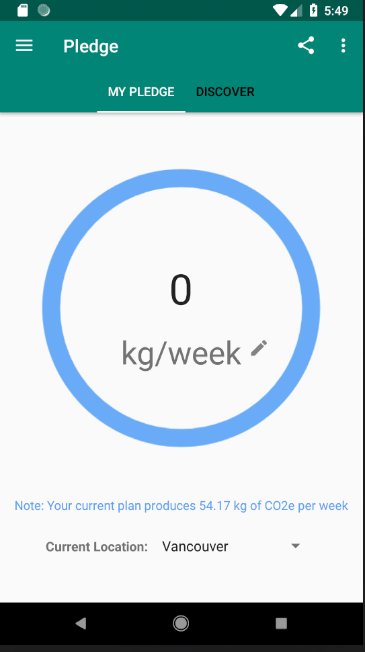 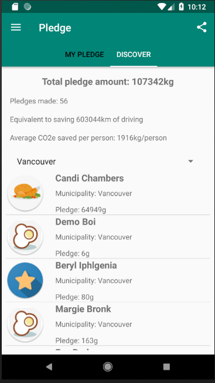

If the user wishes, they can remove their pledge via the 3 dot icon on the top right corner of the application.

## Plan list
This fragment displays a history of the user's plans. The user may choose to switch to a preivous plan if they wish.

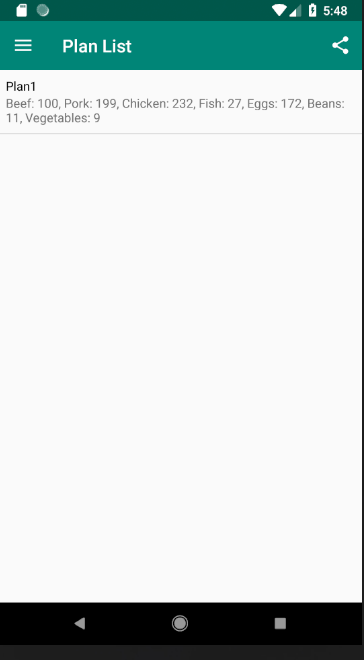

## Share button
The user can their their pledge to social media via the share button on the top right corner.

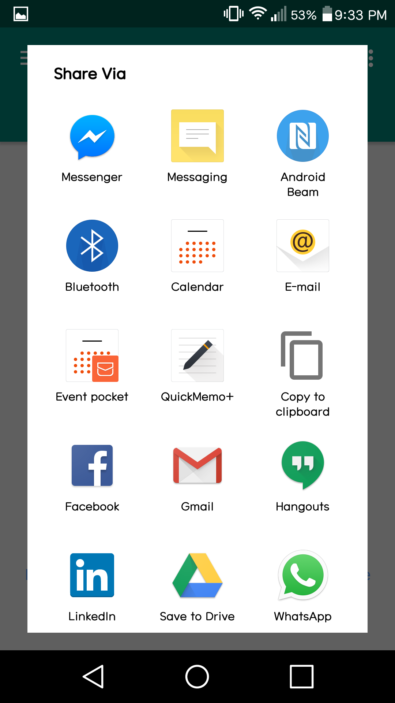

## Settings 
This activity is accessed through the navigation drawer. Currently, it contains access to the about page activity and an option to log out. Upon logging out, the application will close. The back button in the top left corner takes the user back to the dashboard.

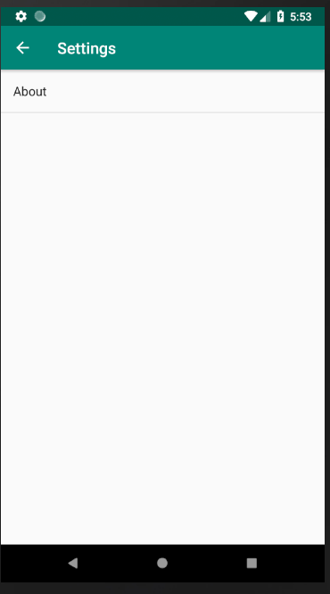

## About Page Activity
The about page activity gives the user an overview of the app: The carbon footprint caused by food, and how changing the foods we eat is environmentally impactful.

